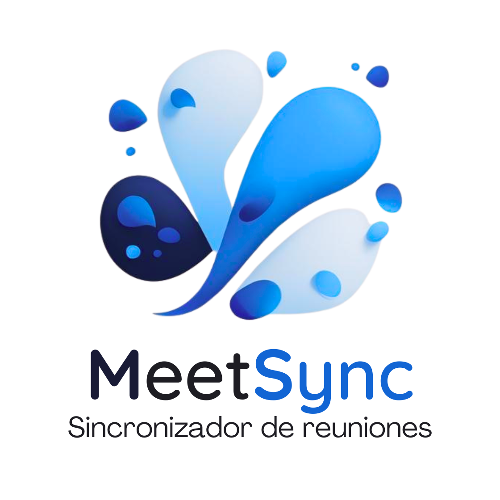

<h1 align="center">MeetSync</h1>

  <em>Sincronizá horarios con tus amigos. Menos chat eterno, más juntadas reales.</em>

  

  <a href="https://github.com/tu-usuario/MeetSync/issues">Reportar un bug</a> ·
  <a href="https://github.com/tu-usuario/MeetSync/discussions">Sugerir una idea</a>

---

## 🚀 Descripción

**MeetSync** es una aplicación web (React + Vite + TypeScript) pensada para coordinar horarios entre amigos de forma rápida y visual.  
Los usuarios marcan su disponibilidad semanal, conectan con amigos y (en futuras versiones) verán sugerencias de lugares/eventos y coordinarán puntos de encuentro.

> Proyecto académico — Generación T. Equipo: Thiago (líder) & Santino (PO) + colaboradores.

---

## ✨ Features (MVP)

- Home con **hero** + beneficios + **FAQ** (acordeón animado).
- **Navegación SPA** con React Router.
- **Amigos** (listado estático por ahora).
- **Login / Register** con layout dedicado (sin Nav/Footer).
- **Perfil** (sección con tarjetas de amigos).
- **Schedule** (maqueta de calendario semanal).
- **Sync** (UI para crear sincronización 1 a 1 o grupal).
- **Nav responsive** con **menú hamburguesa** y overlay en mobile.
- **Dark UI** minimalista, sin Tailwind (CSS modular por componente).

> Roadmap: disponibilidad real, cruces automáticos, recordatorios, lugares sugeridos, mapa de punto de encuentro, notificaciones.

---

## 🧱 Stack

- **Frontend:** React 18, Vite, TypeScript, React Router
- **Estilos:** CSS modular (sin Tailwind).  
- **Íconos:** lucide-react
- **Control de versiones:** Git/GitHub

> Futuro: **Node.js** (API), **SQL Server** (DB).

